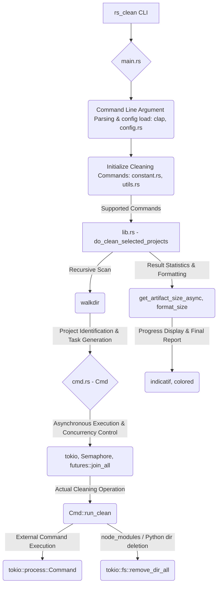

# rs_clean – Clean Build Artifacts for Rust, Go, Gradle, Maven, Node.js, Python, and Flutter

> Easily remove compiled build artifacts from Rust, Go, Gradle, Maven, Node.js, Python, and Flutter projects with a single command.

Looking for Chinese docs? [View 中文说明](./README_zh.md)

---

## Architecture Overview



## Quick Start

```bash
$ rs_clean folder/
```

`rs_clean` scans the given directory (or `-p/--path`), shows how much disk space cleaning would free, and lets you choose what to clean:

```bash
$ rs_clean my_projects/

Scanning for projects to clean...

=== Deletion Preview ===
Found projects to clean:
  1. my_projects/rust_app (cargo) - 156.2 MB
  2. my_projects/go_service (go) - 0 B
  3. my_projects/gradle_app (gradle) - 89.1 MB

Total space to be freed: 245.3 MB

Select cleaning mode:
> Clean all projects
  Select specific projects to clean
  Review each project individually
  Cancel operation
```

Preview sizes measure the artifact directories each cleaner would remove (for example Cargo `target/`), not the whole project tree. Go has no stable artifact directory, so its preview size is `0`.

### Navigation Guide
- **Arrow Keys**: Navigate through options
- **Enter**: Confirm selection
- **Space**: Select/deselect items (in multi-select mode)
- **ESC**: Cancel operation

### Command Line Options

```
rs_clean [OPTIONS] [PATH]
```

- Positional `PATH` and `-p/--path` both select the directory to scan. Passing both is an error. Default is `.` when neither is given (unless a config file sets `path`).
- `--exclude-dir <NAME>` skips directories with that **name** during the scan. Repeat the flag for multiple names. Default: `node_modules`, `target`, `dist`, `build`, `vendor`. This does **not** disable cleaners (`--exclude-dir cargo` does not turn off the cargo cleaner).
- `--exclude-type <TYPE>` disables cleaners by type: `cargo`, `go`, `gradle`, `nodejs` (alias `node`), `flutter`, `python`, `mvn` (`mvn.cmd` counts as `mvn`). Repeat the flag for multiple types. Unknown values are an error.
- `--dry-run` previews without deleting.
- `--no-confirm` skips the interactive prompt (for automation).
- `--verbose` prints the merged configuration.
- `--config <FILE>` loads that file and skips discovery.
- `--max-directory-depth` limits how deep the project walk descends (default 5).
- `--max-files-per-project` caps files counted while sizing artifacts (default 10000).

```bash
# Basic usage with interactive confirmation
$ rs_clean folder/

# Same directory via flag
$ rs_clean --path folder/

# Skip confirmation prompts (for automation)
$ rs_clean folder/ --no-confirm

# Preview what would be deleted without actually deleting
$ rs_clean folder/ --dry-run

# Skip directories named node_modules or build during the scan
$ rs_clean folder/ --exclude-dir node_modules --exclude-dir build

# Disable the cargo cleaner (Rust projects are not listed)
$ rs_clean folder/ --exclude-type cargo

# Show detailed output
$ rs_clean folder/ --verbose

# Load a specific config file (skips discovery)
$ rs_clean --config ./rs_clean.toml folder/
```

### Configuration files

Config is load-only. There is no `rs_clean config init/set/show`.

When `--config` is absent, the first existing file wins:

1. In the current directory: `rs_clean.toml`, `.rs_clean.toml`, `rs_clean.json`, `.rs_clean.json`
2. User config dir (`dirs::config_dir()`): `$CONFIG_DIR/rs_clean/rs_clean.toml`, then `$CONFIG_DIR/rs_clean/rs_clean.json`
   - Linux: `~/.config`
   - Windows: `%APPDATA%`
   - macOS: `~/Library/Application Support`
3. `~/.rs_clean/rs_clean.toml`

`--config <file>` loads only that file. Format follows the extension (`.toml` / `.json`). Unknown keys are an error.

Field names match the runtime config: `path`, `exclude_dir`, `exclude_type`, `max_directory_depth`, `max_files_per_project`, `verbose`, `dry_run`, `no_confirm`.

Overlay order: built-in defaults < file < explicit CLI flags. A file that sets only `verbose` keeps the default `exclude_dir` list. See `rs_clean.example.toml`.

---

## Installation

### Option 1: Install via Cargo

```bash
cargo install rs_clean
```

### Option 2: Download from Releases

[Download from GitHub Releases](https://github.com/pwh-pwh/rs_clean/releases)
Grab the latest binary for your operating system.

---

## Features

* Cleans **Rust** projects: `target/` (`cargo clean`)
* Cleans **Go** projects (`go clean`; preview size is 0)
* Cleans **Gradle** projects: `build/`
* Cleans **Maven** projects: `target/`
* Cleans **Node.js** projects when `node` or `nodejs` is on `PATH` (`node_modules/`, `dist/`, `build/`, `.next/`, …)
* Cleans **Python** projects when `python` is on `PATH` (`__pycache__/`, `venv/`, `.venv/`, `build/`, `dist/`, `.eggs/`, `*.egg-info`, …)
* Cleans **Flutter** projects: `build/` (`flutter clean`)
* Recursively scans subdirectories (limited by `--max-directory-depth`)
* Automatically detects project type
* Interactive preview and selection (default); `--no-confirm` / `--dry-run` for scripts
* Efficient parallel processing with CPU-core-aware concurrency
* Safety limits on scan depth and files counted per artifact directory
* Disk space reporting for artifact roots (before − after)

---

## Example Structure

```bash
$ tree my_projects/
my_projects/
├── rust_app/
│   └── target/
├── go_service/
│   └── bin/
├── gradle_app/
│   └── build/
├── flutter_app/
│   └── build/
└── maven_module/
    └── target/
```

After running:

```bash
$ rs_clean my_projects/
```

The build artifacts will be cleaned:

```bash
$ tree my_projects/
my_projects/
├── rust_app/
├── go_service/
├── gradle_app/
├── flutter_app/
└── maven_module/
```

---

## Use Cases

* Free up disk space by removing large build folders.
* Ensure a clean build environment in CI/CD pipelines.
* Clean multiple types of projects in monorepos.

---

## Roadmap

* [x] Interactive confirmation prompts
* [x] Disk space reporting per project (artifact roots)
* [x] Customizable exclusion lists (`--exclude-dir`, `--exclude-type`, config file)

---

## Contributing

We welcome contributions and feedback!

* Open an [issue](https://github.com/pwh-pwh/rs_clean/issues) for bugs or suggestions
* Submit a pull request for enhancements
* Star the repo if you find it helpful

---

## License

MIT License © 2025 [coderpwh]
