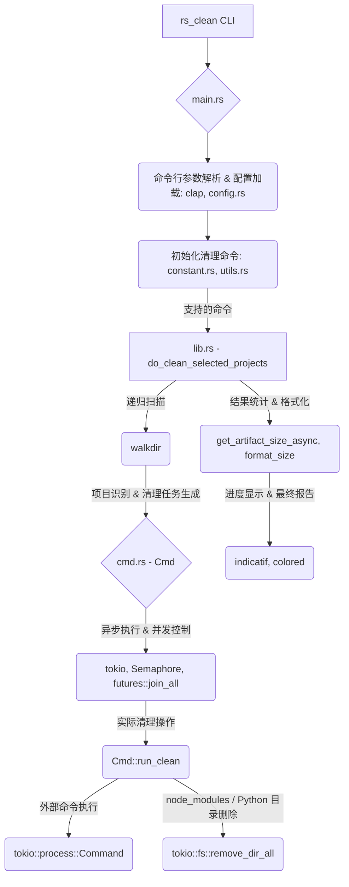

# `rs_clean` – 清理 Rust / Go / Gradle / Maven / Node.js / Python / Flutter 项目构建产物

> 清理 Rust、Go、Gradle、Maven、Node.js、Python、Flutter 等项目的构建产物，指定项目根目录即可。

---

## 架构概览



## 快速开始

```bash
$ rs_clean folder/
```

运行 `rs_clean` 时会扫描目标目录（或 `-p/--path`），预览清理可释放的磁盘空间，并让你选择要清理的项目：

```bash
$ rs_clean my_projects/

Scanning for projects to clean...

=== Deletion Preview ===
Found projects to clean:
  1. my_projects/rust_app (cargo) - 156.2 MB
  2. my_projects/go_service (go) - 0 B
  3. my_projects/gradle_app (gradle) - 89.1 MB

Total space to be freed: 245.3 MB

Select cleaning mode:
> Clean all projects
  Select specific projects to clean
  Review each project individually
  Cancel operation
```

预览大小是各清理器将删除的产物目录（例如 Cargo 的 `target/`），而不是整个项目树。Go 没有稳定的产物目录，预览大小为 `0`。

### 操作指南
- **方向键**：在选项间导航
- **回车键**：确认选择
- **空格键**：选择/取消选择项目（多选模式）
- **ESC**：取消操作

### 命令行选项

```
rs_clean [OPTIONS] [PATH]
```

- 位置参数 `PATH` 与 `-p/--path` 都表示要扫描的目录。同时提供两者会报错。都未提供时默认为 `.`（除非配置文件设置了 `path`）。
- `--exclude-dir <NAME>` 扫描时跳过**目录名**匹配的目录。多个名称请重复该参数。默认：`node_modules`、`target`、`dist`、`build`、`vendor`。这**不会**禁用清理器（`--exclude-dir cargo` 不会关闭 cargo 清理器）。
- `--exclude-type <TYPE>` 按类型禁用清理器：`cargo`、`go`、`gradle`、`nodejs`（别名 `node`）、`flutter`、`python`、`mvn`（`mvn.cmd` 视为 `mvn`）。多个类型请重复该参数。未知值会报错。
- `--dry-run` 只预览，不删除。
- `--no-confirm` 跳过交互确认（适合自动化）。
- `--verbose` 打印合并后的配置。
- `--config <FILE>` 只加载该文件，跳过自动发现。
- `--max-directory-depth` 限制项目扫描深度（默认 5）。
- `--max-files-per-project` 限制计算产物大小时计入的文件数（默认 10000）。

```bash
# 基本用法（带交互确认）
$ rs_clean folder/

# 使用 -p/--path
$ rs_clean --path folder/

# 跳过确认提示（适用于自动化脚本）
$ rs_clean folder/ --no-confirm

# 预览将要删除的内容但不实际删除
$ rs_clean folder/ --dry-run

# 扫描时跳过名为 node_modules 或 build 的目录
$ rs_clean folder/ --exclude-dir node_modules --exclude-dir build

# 禁用 cargo 清理器（不列出 Rust 项目）
$ rs_clean folder/ --exclude-type cargo

# 显示详细输出
$ rs_clean folder/ --verbose

# 加载指定配置文件（跳过发现）
$ rs_clean --config ./rs_clean.toml folder/
```

### 配置文件

配置是只读加载，没有 `rs_clean config init/set/show` 子命令。

未指定 `--config` 时，使用第一个存在的文件：

1. 当前目录：`rs_clean.toml`、`.rs_clean.toml`、`rs_clean.json`、`.rs_clean.json`
2. 用户配置目录（`dirs::config_dir()`）：`$CONFIG_DIR/rs_clean/rs_clean.toml`，然后 `$CONFIG_DIR/rs_clean/rs_clean.json`
   - Linux：`~/.config`
   - Windows：`%APPDATA%`
   - macOS：`~/Library/Application Support`
3. `~/.rs_clean/rs_clean.toml`

`--config <file>` 只加载该文件。格式由扩展名决定（`.toml` / `.json`）。未知字段会报错。

字段名与运行时配置一致：`path`、`exclude_dir`、`exclude_type`、`max_directory_depth`、`max_files_per_project`、`verbose`、`dry_run`、`no_confirm`。

覆盖顺序：内置默认值 < 配置文件 < 显式命令行参数。文件只设置 `verbose` 时，不会清空默认的 `exclude_dir`。参见 `rs_clean.example.toml`。

---

## 安装方式

### 方式 1：使用 Cargo 安装（推荐）

```bash
cargo install rs_clean
```

### 方式 2：从 Release 页面下载可执行文件

[前往 Releases 页面](https://github.com/pwh-pwh/rs_clean/releases) 下载适合你系统的版本（如 macOS/Linux/Windows）。

---

## 功能特性

* 支持 **Rust** 项目（`target/`，`cargo clean`）
* 支持 **Go** 项目（`go clean`；预览大小为 0）
* 支持 **Gradle** 项目（`build/`）
* 支持 **Maven** 项目（`target/`）
* 支持 **Node.js** 项目（`PATH` 上有 `node` 或 `nodejs` 时：`node_modules/`、`dist/`、`build/`、`.next/` 等）
* 支持 **Python** 项目（`PATH` 上有 `python` 时：`__pycache__/`、`venv/`、`.venv/`、`build/`、`dist/`、`.eggs/`、`*.egg-info` 等）
* 支持 **Flutter** 项目（`build/`，`flutter clean`）
* 递归扫描子目录（受 `--max-directory-depth` 限制）
* 自动识别项目类型并清理
* 默认交互预览与选择；脚本可用 `--no-confirm` / `--dry-run`
* 高效并行处理：异步操作与 CPU 核心感知
* 可配置的安全机制：扫描深度与产物文件数量限制
* 磁盘空间报告：产物目录清理前后的差值

---

## 示例

```bash
$ tree my_project/
my_project/
├── rust_project/
│   └── target/
├── go_project/
│   └── bin/
├── gradle_project/
│   └── build/
├── flutter_project/
│   └── build/
└── maven_project/
    └── target/
```

```bash
$ rs_clean my_project/
```

清理完成后：

```bash
$ tree my_project/
my_project/
├── rust_project/
├── go_project/
├── gradle_project/
├── flutter_project/
└── maven_project/
```

---

## 使用场景

* 项目根目录空间紧张，需要快速释放磁盘。
* CI/CD 脚本中快速清理构建缓存。
* 清理多语言项目的中间文件。

---

## 开发计划

* [x] 交互确认模式
* [x] 按项目的产物目录磁盘空间报告
* [x] 可配置排除列表（`--exclude-dir`、`--exclude-type`、配置文件）

---

## 欢迎贡献

欢迎提 Issue、PR 和 Star。
一起让 `rs_clean` 更加好用。
